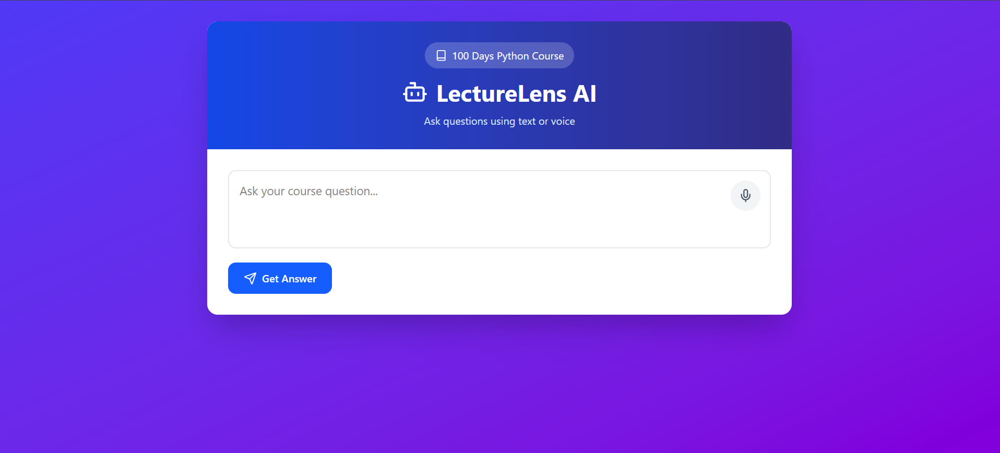
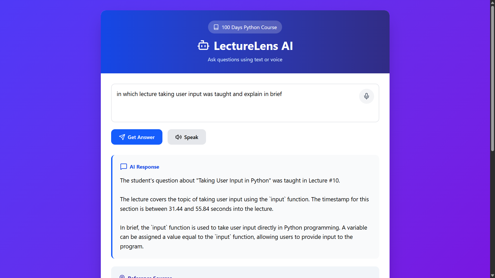
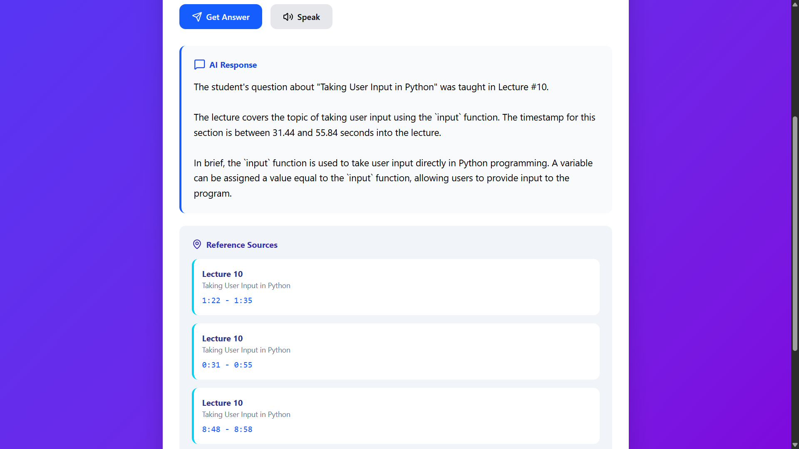

# LectureLens RAG

LectureLens RAG is a Retrieval-Augmented Generation (RAG) based AI assistant designed to help students navigate course lectures intelligently using natural language queries.

The system processes lecture videos, converts them into searchable embeddings, retrieves semantically relevant lecture chunks using FAISS vector search, and generates grounded responses using a local Ollama LLM.

---

# Features

- AI-powered semantic lecture search
- Voice input support using Speech Recognition
- Voice output using Text-to-Speech
- Timestamp-based lecture navigation
- Retrieval-Augmented Generation (RAG)
- FAISS vector similarity search
- Local LLM inference using Ollama
- Query caching system for faster repeated responses
- Full-stack architecture using Flask + React

---

# Tech Stack

## Frontend
- React.js
- Tailwind CSS
- Axios
- SpeechRecognition API
- SpeechSynthesis API

## Backend
- Flask
- Python
- Ollama
- FAISS
- Pandas
- NumPy
- Joblib

## AI / ML
- Whisper (Speech-to-Text)
- nomic-embed-text (Embeddings)
- llama3.2 (LLM)
- Retrieval-Augmented Generation (RAG)

---

# How It Works

## 1. Lecture Processing Pipeline

Lecture videos are:
- converted from MP4 to MP3
- transcribed using Whisper
- chunked into meaningful segments
- embedded using nomic-embed-text
- indexed using FAISS

---

## 2. User Query Flow

User Query
→ Query Embedding
→ FAISS Semantic Retrieval
→ Relevant Lecture Chunks
→ Ollama LLM Response Generation
→ Final Grounded Answer

---

# Architecture

```text
Lecture Videos
    ↓
Audio Extraction
    ↓
Whisper Transcription
    ↓
Chunking + Metadata
    ↓
Embeddings Generation
    ↓
FAISS Vector Index
    ↓
User Query
    ↓
Semantic Retrieval
    ↓
LLM Response Generation
```

---

# Voice Features

LectureLens supports:
- microphone-based voice queries
- AI-generated spoken responses

This creates an interactive AI learning assistant experience.

---

# Caching System

The backend includes a lightweight query caching layer using JSON-based storage.

If the same query is asked multiple times:
- cached response is returned instantly
- unnecessary LLM generation is avoided
- overall response time improves

---

# Project Structure

```text
LectureLens-AI/
│
├── backend/
│   ├── app.py
│   ├── build_faiss.py
│   ├── embeddings.joblib
│   ├── faiss_index.bin
│
├── frontend/
│   ├── src/
│   ├── App.jsx
│
├── jsons/
├── newjsons/
│
├── README.md
```

---

# Installation

## 1. Clone Repository

```bash
git clone https://github.com/yourusername/LectureLens-AI.git
```

---

## 2. Install Backend Dependencies

```bash
pip install -r requirements.txt
```

---

## 3. Install Frontend Dependencies

```bash
npm install
```

---

## 4. Start Ollama

Make sure Ollama is running locally.

Pull required models:

```bash
ollama pull llama3.2
ollama pull nomic-embed-text
```

---

## 5. Run Backend

```bash
python app.py
```

---

## 6. Run Frontend

```bash
npm run dev
```

---

# Sample Queries

- "Where were Python comments taught?"
- "Explain Exercise 1"
- "Which lecture covers loops?"
- "What are operators in Python?"

---

# Future Improvements

- Better semantic chunking
- MongoDB integration
- Real-time streaming responses
- Better transcription models
- Multi-course support
- Semantic query caching
- User authentication

---

# Why RAG Instead of Fine-Tuning?

This project uses Retrieval-Augmented Generation because:
- lecture content changes dynamically
- no expensive model retraining required
- responses remain grounded in lecture data
- easier scalability and updates

---

# Screenshots

Add screenshots here:





---

# Author

Rudeus

BTech IT Student | AI + Full Stack Development Enthusiast